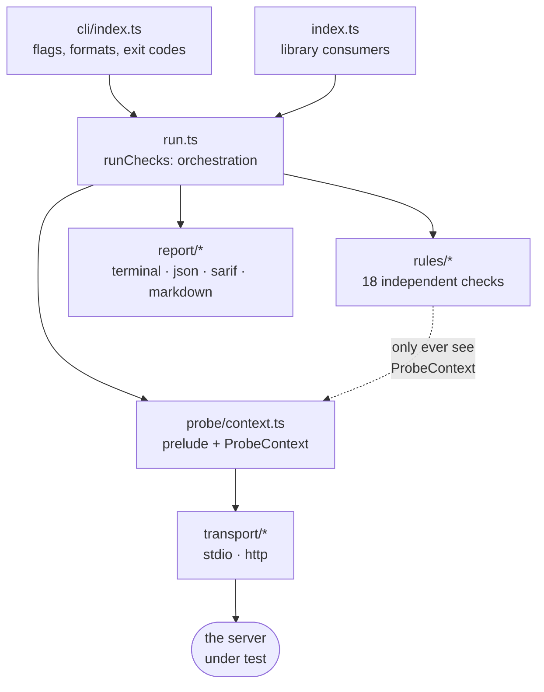
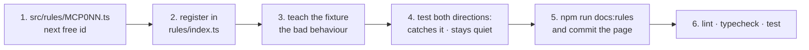

# mcp-stateless — project guide

What this project is, how it is built, how the pieces fit together, and how work
flows through it. The [README](../README.md) is the user-facing pitch;
[CONTRIBUTING](../CONTRIBUTING.md) is the recipe for adding a rule. This is the
map in between — the document to hand a teammate who needs to understand the
whole thing, not just the file they are editing.

**Reading paths**

| If you are…                       | Read                            |
| --------------------------------- | ------------------------------- |
| explaining the project to someone | §0, §1, §2, then §15            |
| about to write a rule             | §0, §5, §6, §7, §10, §11        |
| touching transports or the CLI    | §4, §5, §8, §9                  |
| reviewing a PR                    | §7 (findings), §13 (invariants) |
| deciding whether to adopt it      | §1, §2, §15                     |

---

## 0. The one-minute version

> MCP — the protocol LLM clients use to talk to tool servers — released a
> revision on **28 July 2026** that made the protocol stateless. It deleted the
> connection handshake, deleted sessions, deleted four methods, renumbered the
> error codes, and made a new method mandatory. Thousands of existing MCP servers
> are now non-compliant, on a twelve-month deprecation clock, and the spec
> shipped **no tooling** to tell an author where their server stands.
>
> `mcp-stateless` is that tooling. You point it at a running server; it holds a
> real conversation with it, and reports precisely which of the breaking changes
> that server fails — with the wire traffic that proves each one, the spec link
> behind it, the concrete fix, and — the part maintainers actually care about —
> whether it is _their_ bug or their _SDK's_.

**If your team remembers three things:**

1. **It probes behaviour, not source code.** No parsing, no config-file reading,
   no version-string trust. It asks the server questions and judges the answers,
   so it cannot be lied to.
2. **It tells you who has to fix it.** Against a stock-SDK server, most findings
   are protocol plumbing the SDK owns — they disappear on upgrade. Splitting the
   report on that line turns "10 failures" into "1 thing to do".
3. **It refuses to guess.** A server it cannot reach produces zero findings, not
   eighteen. Where the spec permits two behaviours, it reports neither. Being
   confidently wrong is the one failure mode that would kill adoption.

### A five-minute demo

The fastest way to explain it is to run it. Everything below works from a clean
clone with no server of your own:

```bash
npm install && npm run build

# 1. A compliant server — exits 0, says READY.
node dist/cli/index.js --stdio "node test/fixtures/servers/stdio-server.mjs modern"

# 2. A 2025-era server — exits 1, itemises every break and who owns it.
node dist/cli/index.js --stdio "node test/fixtures/servers/stdio-server.mjs legacy"

# 3. The same run, showing the JSON-RPC traffic behind each verdict.
node dist/cli/index.js --stdio "node test/fixtures/servers/stdio-server.mjs legacy" --verbose

# 4. A server that does not start — exits 2, and invents nothing.
node dist/cli/index.js --stdio "node --eval \"process.exit(1)\"" --timeout 2000
```

Run 2 next to run 4 is the whole design argument in ten seconds: the tool is
loud when it has evidence and silent when it does not.

For the long-form version — a real server taken from 7 breaking findings to
READY, including what the tool got wrong — see the
[migration walkthrough](migration-walkthrough.md).

### What has shipped

`0.1.0` through `0.1.5`, all on 2026-08-18: 18 rules, both transports, four
report formats, a GitHub Action, a landing page, and the migration walkthrough.
`0.1.3` was the first release containing fixes found by contact with a real
migrated server rather than with fixtures — five defects, because the fixtures
had encoded the same assumptions as the rules. `0.1.4` moved publishing to npm
**trusted publishing** (OIDC), so every version from there carries signed
provenance and no release token exists to leak. See the
[CHANGELOG](../CHANGELOG.md).

---

## 1. What the project is

`mcp-stateless` is a **conformance probe and migration checker** for MCP servers.

You point it at a running MCP server. It talks to that server over the wire,
watches how it answers, and reports which parts of the MCP `2026-07-28`
specification the server violates — with the JSON-RPC traffic that proves each
finding and the specific code change that fixes it.

```bash
npx mcp-stateless --stdio "node dist/server.js"
npx mcp-stateless --http https://api.example.com/mcp
```

It is a CLI, a library, and a GitHub Action, built from one code path.

### The problem it solves

MCP revision `2026-07-28` made the protocol **stateless**, and in doing so
broke almost everything about the previous lifecycle:

| Removed                                           | Added / changed                     |
| ------------------------------------------------- | ----------------------------------- |
| `initialize` / `notifications/initialized`        | `server/discover` is mandatory      |
| `Mcp-Session-Id` and protocol sessions            | `Mcp-Method` / `Mcp-Name` headers   |
| `ping`, `logging/setLevel`, `resources/subscribe` | per-request `_meta` envelope        |
| server-initiated requests                         | Multi Round-Trip Requests           |
| SSE stream resumability                           | `resultType`, `ttlMs`, `cacheScope` |
| old error-code numbering                          | renumbered `-32020`+ range          |

Thousands of servers must migrate on a twelve-month clock, and the spec shipped
no tooling to tell an author where they stand. That gap is this project.

### The two ideas that shape the whole design

**1. Probe behaviour, do not read source.** The checker never looks at your
code. It cannot be fooled by a config flag or a version string; it only reports
what the server actually did on the wire. Every finding carries its evidence.

**2. Say who has to fix it.** Most of what breaks is protocol plumbing owned by
the MCP SDK — you never wrote a `ping` handler, the SDK registered one. So each
rule declares `remediation: 'sdk' | 'application'`, and reports split on that
line: _"9 of these vanish when you upgrade; 1 needs your afternoon."_ This one
distinction is what turns a wall of 10 failures into a task list of 1.

---

## 2. Why the version is a date

`2026-07-28` **is** the version number. MCP versions its specification by
**publication date** — `YYYY-MM-DD` — not by semver. There is no "MCP 3.0"; there
is the revision cut on 28 July 2026, and the revisions cut before it. From
[src/protocol.ts](../src/protocol.ts):

```ts
export const TARGET_REVISION = '2026-07-28';
export const LEGACY_REVISIONS = ['2025-11-25', '2025-06-18', '2025-03-26'] as const;
```

This trips up nearly everyone new to the project, so it is worth the paragraph:

- **A spec is not a library.** Semver encodes one publisher's compatibility
  promise about one artifact. A protocol revision is a _negotiated_ snapshot: a
  client at one revision talks to a server at another, written by strangers. The
  useful question at negotiation time is not "was this breaking" but "which
  snapshot is this, and is it older or newer than mine". A date answers that.
- **It ends the major-vs-minor argument.** Dates carry no compatibility claim, so
  the changelog carries it instead — honest, and it is why this tool exists as a
  separate artifact from the spec.
- **Ordering is free.** ISO 8601 sorts lexicographically in the same order it
  sorts chronologically, so `'2026-07-28' > '2025-11-25'` is a plain string
  comparison. No parsing, no version objects. Treat the string as an opaque
  identifier you compare, never one you do arithmetic on.
- **SDKs still use semver**, and lag. The reference TypeScript SDK's `1.30.0`
  predates the spec by a day. That lag is exactly why the `sdk` /
  `application` remediation split (§1) is the most useful thing the report does.

### Where the date travels on the wire

This is the part `2026-07-28` changed, and it is why the string is so visible
throughout the codebase:

| Before                                                                    | After                                                                                  |
| ------------------------------------------------------------------------- | -------------------------------------------------------------------------------------- |
| sent **once** in `initialize` as `protocolVersion`, kept in session state | sent on **every request** in `_meta` as `io.modelcontextprotocol/protocolVersion`      |
| —                                                                         | advertised by the server from `server/discover` as `supportedVersions: ["2026-07-28"]` |
| —                                                                         | echoed in the `MCP-Protocol-Version` HTTP header                                       |

Statelessness forced that: with no handshake to remember, every request has to
name its own revision. Which is also why [MCP002](../src/rules/MCP002.ts) can
detect a stateful server at all — it checks whether the server reads the version
from `_meta` or from memory it should no longer have.

---

## 3. The stack

Deliberately small. **Zero runtime dependencies**, and that is a hard rule — a
tool that runs in other people's CI should not drag a tree into it.

| Concern         | Choice                                                        | Why                                                                        |
| --------------- | ------------------------------------------------------------- | -------------------------------------------------------------------------- |
| Language        | TypeScript 5.7, `strict`                                      | Plus `noUncheckedIndexedAccess` — wire data is untrusted by definition     |
| Modules         | ESM (`"type": "module"`, `NodeNext`)                          | Matches the Node baseline; no dual-build complexity                        |
| Runtime         | Node ≥ 20                                                     | Needs built-in `fetch`, `parseArgs`, web streams                           |
| Arg parsing     | `node:util.parseArgs`                                         | Would otherwise be commander/yargs — see the zero-dep rule                 |
| HTTP            | built-in `fetch` + `ReadableStream`                           | SSE is parsed by hand from `data:` frames                                  |
| Child processes | `node:child_process.spawn`, never `shell: true`               | Command strings are tokenized by us, so behaviour matches across platforms |
| Terminal colour | ~12 lines of hand-rolled ANSI                                 | Not worth a dependency                                                     |
| Tests           | Vitest 3                                                      | Real fixture servers, real stdio, real sockets — no mocks                  |
| Lint / format   | ESLint 9 (flat config) + Prettier                             | `format:check` runs in CI                                                  |
| Docs            | `scripts/gen-rule-docs.mjs`                                   | `docs/rules/*.md` generated from rule JSDoc; CI fails if stale             |
| Distribution    | npm package (`bin` + `exports`) and a composite GitHub Action | One code path, three front doors                                           |
| Landing page    | React 19 + Vite + Tailwind 4, in `site/`                      | Its **own** package, deliberately not a workspace — see below              |

The one dependency-heavy corner is the landing page, and it is fenced off on
purpose: `site/` has a separate `package.json`, `package-lock.json`, ESLint and
Prettier config, and is **not** a workspace of the root package. A workspace
would hoist React into the root lockfile and make "zero runtime dependencies"
a claim that needed asterisks. It is checked and deployed by its own workflow,
and the published npm package never sees it.

---

## 4. Repo map

```
src/
  cli/index.ts        argv → options → run → render → exit code
  index.ts            public library surface (what npm consumers import)
  run.ts              orchestrator: build context, run rules, aggregate report
  protocol.ts         every version-specific constant, in one file
  probe/context.ts    the prelude + the ProbeContext rules receive
  transport/
    types.ts          the Transport / Exchange boundary
    stdio.ts          newline-delimited JSON-RPC over a child process
    http.ts           Streamable HTTP, incl. SSE reading and raw probes
    spawn-plan.ts     making Windows spawn `npx` without a shell
  rules/
    types.ts          Rule, Finding, severity, remediation, finding()
    index.ts          the registry (ALL_RULES)
    helpers.ts        shared checks, e.g. "this method was removed, is it gone?"
    MCP001.ts … MCP018.ts   one file per rule
  report/
    terminal.ts  json.ts  sarif.ts  markdown.ts

test/
  *.test.ts                       seven suites
  fixtures/servers/handlers.mjs   hand-written MCP behaviour, right and wrong
  fixtures/servers/stdio-server.mjs, http-server.mjs
  fixtures/fakebin/               a fake `.cmd` shim, for the Windows spawn tests

site/                  React landing page — its own package, own lockfile
docs/
  ARCHITECTURE.md      this file
  migration-walkthrough.md   a real server taken from 7 findings to READY
  rules/               generated rule pages, one per MCP0NN
scripts/               the docs generator
action.yml             composite GitHub Action
.github/workflows/     ci.yml · release.yml · pages.yml
```

---

## 5. Architecture

Four layers, and the dependency arrows only point one way.



**The load-bearing boundary is between rules and transports.** A rule receives
a `ProbeContext` and nothing else. It never constructs a transport, never sees
a socket or a child process, never assumes it ran before or after another rule.
That is what makes a new rule a genuinely self-contained change — one file, one
registry line, one test — and it is why `transport/types.ts` opens with a
comment saying rules never import it.

### The `Exchange` — the unit of evidence

Everything flows through one record ([transport/types.ts](../src/transport/types.ts)):

```ts
interface Exchange {
  request: JsonRpcRequest;
  requestHeaders: Record<string, string>;
  response: JsonRpcResponse | null;
  responseHeaders: Record<string, string>;
  status?: number; // HTTP only
  timingMs: number;
  transportError?: string; // no valid response came back at all
}
```

The distinction encoded here runs through the whole tool:

- **A JSON-RPC error is a conversation.** The server is alive and has an
  opinion. That is data a rule can judge.
- **A `transportError` is a failure to converse** — timeout, crash, refused
  connection, unparseable output. It is not evidence about conformance.

Findings quote exchanges verbatim, which is why `--verbose` can show you the
exact traffic behind a verdict instead of asking you to trust one.

---

## 6. What one run actually does

### Step 1 — the prelude

Before any rule runs, [probe/context.ts](../src/probe/context.ts) performs a
**fixed opening sequence** once and shares the result. Two reasons: rules stay
cheap and ordering-free, and the server is not subjected to eighteen
near-identical handshake attempts.

```mermaid
sequenceDiagram
    participant P as mcp-stateless
    participant S as server under test
    P->>S: server/discover (with _meta)
    Note right of P: mandatory now;<br/>harmless against a legacy server
    P->>S: tools/list (no handshake first)
    Note right of P: BEFORE initialize — on stdio a successful<br/>handshake would persist in the child and<br/>mask a still-stateful server
    P->>S: initialize (legacy, no _meta)
    Note right of P: expected to FAIL on a compliant server
    P->>S: tools/list (only if #2 failed and #3 worked)
    Note right of P: that combination *is* the signature<br/>of a stateful server
    P->>S: tools/list (again, if listing works at all)
    Note right of P: for the ordering-determinism check
```

**The ordering is the cleverness of the tool.** Three very different faults
look identical from outside — "requires the handshake", "chokes on `_meta`",
"rejects the routing headers" all just return an error to a naive client. Only
this specific sequence separates them.

### Step 2 — reachability

`runChecks` then asks one question before judging anything: did _every single_
probe come back as a `transportError`? If so the report is `UNREACHABLE`, with
**zero findings** — because eighteen confident verdicts about a server that
failed to start would be worse than no output at all. That case exits `2`
(operational failure), not `1` (findings).

### Step 3 — rules

Applicable rules — filtered by transport, then by `--only` / `--skip` — run
**sequentially, in id order**, sharing the one connection. Sequential is a
choice, not laziness: several rules deliberately provoke error paths, and a
server under concurrent probing produces reports nobody can reproduce.

Each rule is wrapped in a try/catch. A rule that throws is recorded as
`crashed` and the run continues — a crash is a bug in _us_, and it must not cost
the user the other seventeen results. Tests assert `crashedRules` is always
empty.

### Step 4 — aggregate and render

The `RunReport` is pure data. Severity counts decide `ready` (warnings never
block), and the report goes to one of four renderers. Nothing about rendering
can change a verdict.

---

## 7. Anatomy of a rule

A rule is metadata plus one `run` function ([rules/types.ts](../src/rules/types.ts)):

```ts
export const MCP001: Rule = {
  id: 'MCP001', // permanent — never reused, never renumbered
  title: 'server/discover is not implemented',
  remediation: 'sdk', // or 'application'
  severity: 'error', // or 'warning'
  specRef: specUrl('basic/lifecycle'),
  changelogRef: 'Major change 3 (SEP-2575)',
  appliesTo: ['stdio', 'http'],
  async run(ctx) {
    /* → Finding[] */
  },
};
```

Ids are permanent **because someone has them in a `--skip` list in CI** — a
retired rule leaves a hole rather than letting a suppression silently start
suppressing something else.

Every `Finding` answers three questions, and each field has a distinct job:

- **`observed`** — what the probe actually saw, quoting real values. Never a
  paraphrase of the title.
- **`expected`** — what the spec requires, in the spec's own terms.
- **`fix`** — the concrete change. _"Change the resource-not-found code from
  `-32002` to `-32602`"_, not _"make your server compliant"_.

Plus `specRef` (a deep link) and `evidence` (the exchanges).

### Severity and remediation

|                              |                                                                           |
| ---------------------------- | ------------------------------------------------------------------------- |
| `severity: 'error'`          | a 2026-07-28 client will not work against this server                     |
| `severity: 'warning'`        | deprecated, a `SHOULD`, or a degradation                                  |
| `remediation: 'sdk'`         | _would this disappear if they upgraded the SDK and changed nothing else?_ |
| `remediation: 'application'` | a choice the server author made: capabilities declared, schemas written   |

When in doubt, `warning`. Being wrong in the `error` direction costs a user a
broken build, and **a tool that cries wolf gets uninstalled.**

### Rules are allowed to be careful

[MCP002](../src/rules/MCP002.ts) is worth reading as the exemplar. It separates
_requires_ the handshake (error — everything breaks) from merely _accepts_ it
(warning — clients still work). And it accepts **two** defensible rejections of
`initialize`: `-32601` because the method is gone, or `-32022` because receiving
`initialize` at all reads as a legacy-era client announcing itself. The
reference SDK chose the latter — faulting it would mean inventing a requirement
the spec does not state. Where the spec is silent, the rules stay silent.

The false-positive discipline is visible in comments too: MCP001 records that an
earlier draft guessed the field name `protocolVersions` instead of
`supportedVersions` and reported an error against every compliant server. That
note is left in place on purpose.

---

## 8. Transports

Both implement the same `Transport` interface, so `run.ts` and every rule are
transport-agnostic; `appliesTo` handles the checks that only make sense on one.

### stdio — [transport/stdio.ts](../src/transport/stdio.ts)

Newline-delimited JSON-RPC over a child process's stdin/stdout. Notable
behaviour:

- **`tokenizeCommand`** splits the command string itself, honouring quotes and
  escapes, so `--stdio "node dist/server.js"` behaves identically on Windows and
  POSIX and no stray metacharacter gets interpreted. Backslashes only escape
  characters that need it, so `C:\foo` survives.
- Non-JSON lines on stdout are surfaced as diagnostics — a server logging to
  stdout corrupts the stream for _every_ client, not just this one.
- Failures (crash, exit, timeout) resolve in-flight requests with a synthetic
  marker that `send` converts into a `transportError`, so a caller **always**
  gets an `Exchange` back and never an exception.
- stderr and exit codes are collected as `diagnostics()`, which is how a failed
  launch gets explained instead of just reported.

### The Windows spawn problem — [transport/spawn-plan.ts](../src/transport/spawn-plan.ts)

This file is small and entirely non-obvious, so it is worth knowing why it
exists. Most MCP servers are launched with `npx`. On Windows `npx` is a `.cmd`
shim: Node cannot resolve a bare `npx` without `shell: true` (ENOENT), and since
the fix for CVE-2024-27980 it refuses to spawn a `.cmd` directly at all.
`shell: true` is off the table — it would reinterpret every metacharacter the
tokenizer exists to protect against.

So `planSpawn` resolves the executable itself:

1. Walk `PATH`, trying each `PATHEXT` extension. **Extensions are tried before
   the bare name**, exactly as `cmd.exe` does — npm ships `npx`, `npx.cmd` and
   `npx.ps1` in one directory, and a bare-name match finds the POSIX sh script
   that Windows cannot run.
2. A normal executable is spawned directly.
3. A `.cmd` / `.bat` shim goes through `cmd /d /s /c "<line>"` — `/d` skips
   AutoRun scripts, `/s` makes cmd strip exactly the outer quote pair — with
   every argument quoted by `quoteForCmd`, which doubles backslashes only where
   they precede a quote so Windows paths stay intact.
4. If nothing resolves, let `spawn` produce its own ENOENT with the name the user
   typed rather than inventing an error.

`PATHEXT` is read from an injected `env` rather than `process.env`; honouring it
only halfway made this resolve differently on a case-sensitive filesystem than
on Windows, which CI caught and a local run never would.

### Streamable HTTP — [transport/http.ts](../src/transport/http.ts)

- Sends the routing headers the spec requires; `SendOptions.omitStandardHeaders`
  lets the relevant rule check that a server tolerates their absence.
- Response headers are recorded verbatim so rules can spot artefacts of the
  removed session layer (`Mcp-Session-Id`).
- SSE responses are read frame by frame until one parses as a response carrying
  our id, capped at 512 KB. Resumability was removed in this revision, so there
  are no event ids to track.
- `rawRequest` issues a **non**-JSON-RPC request (used to detect a leftover GET
  stream endpoint) and reads a bounded 2 KB / 1 s preview — deliberately never
  draining, because a legacy SSE endpoint holds the stream open forever.
- `close()` is a no-op. Stateless by construction; there is nothing to tear
  down.

---

## 9. Reporting and exit codes

| Format     | Purpose                                                                                                                                                                                                  |
| ---------- | -------------------------------------------------------------------------------------------------------------------------------------------------------------------------------------------------------- |
| `text`     | The default. Grouped breaking / advisory, with the SDK-vs-your-code split in the summary. `--verbose` appends the wire traffic. Colour is suppressed unless stdout is a TTY, and honours `NO_COLOR`.     |
| `json`     | `schemaVersion: 1` — a **public contract**. Flat and data-only (no `Rule` objects, which carry functions), with a `summary` block including `sdkErrors` / `applicationErrors`.                           |
| `sarif`    | SARIF 2.1.0 for `upload-sarif`; findings land in the GitHub Security tab. SARIF is file-oriented and this tool probes a live server, so results anchor to `README.md` — what other non-file scanners do. |
| `markdown` | For a PR comment or `$GITHUB_STEP_SUMMARY`.                                                                                                                                                              |

**Exit codes:** `0` ready · `1` findings at or above `--fail-on` · `2` usage
error or unreachable server. Keeping unreachable at `2` matters: a broken launch
should never be mistaken for a conformance verdict.

---

## 10. Testing strategy

**No mocks.** Every rule is exercised against real fixture MCP servers over real
stdio and real HTTP sockets.

The fixtures in `test/fixtures/servers/handlers.mjs` are hand-written plain
JavaScript, not SDK-based, and that is the point: the suite needs a server that
emits _wrong_ behaviour exactly — stateful gating, live `ping`, `-32002`
not-found, non-deterministic list ordering — and an up-to-date SDK would refuse
to do any of it. Modes:

| Mode             | Behaviour                                                 |
| ---------------- | --------------------------------------------------------- |
| `legacy`         | a 2025-11-25 server: stateful, removed methods still live |
| `modern`         | a clean 2026-07-28 server                                 |
| `strict-params`  | modern, but rejects any request carrying `params._meta`   |
| `strict-headers` | modern, but strict about the required routing headers     |

Every rule needs **both directions**, and the second matters more:

```ts
it('catches the legacy behaviour', async () => {
  const report = await checkStdio('legacy', { only: ['MCP0NN'] });
  expect(ruleIds(report)).toContain('MCP0NN');
});

it('stays quiet on a compliant server', async () => {
  const report = await checkStdio('modern', { only: ['MCP0NN'] });
  expect(report.findings).toEqual([]);
});
```

Two details worth copying: `test/helpers.ts` quotes the fixture path so the
tokenizer is exercised on every run (this repo lives under a directory with a
space); and `vitest.config.ts` sets `fileParallelism: false`, because suites
spawn processes and bind ports, and serial execution keeps cleanup predictable
across platforms.

Alongside the fixtures, the tool is run against the official
`@modelcontextprotocol/*` servers. **Zero false positives and zero rule
crashes** is the standing bar — a wrong rule is filed as a bug, not a
preference.

---

## 11. Development workflow

```bash
npm install         # no runtime deps to install; devDeps only
npm test            # full suite against real fixture servers
npm run test:watch
npm run typecheck
npm run lint
npm run format
npm run docs:rules  # regenerate docs/rules/ after editing a rule
npm run build       # tsc -p tsconfig.build.json → dist/
```

### The add-a-rule loop



Step 5 is not optional — `docs/rules/*.md` is **generated from the rule
sources**, and CI's `docs:check` fails when they drift. The generator reads the
metadata block plus the JSDoc directly above the export, so that JSDoc should
explain _why the spec changed_, written for a maintainer meeting the change for
the first time. Keep helper constants above the JSDoc, never between it and the
export, or the generator will not find it.

---

## 12. CI and release workflow

**[ci.yml](../.github/workflows/ci.yml)** — on push to `main`, every PR, and
manual dispatch. Three jobs:

- **test** — Node 20 / 22 / 24 on Ubuntu, plus Node 22 on Windows and macOS. The
  extra platforms exist specifically because the stdio transport spawns
  processes and tokenizes commands, and both differ per OS.
- **quality** — lint, `format:check`, and `docs:check`.
- **dogfood** — builds the CLI and runs it against its own fixtures, asserting
  the _contract_ rather than just the code: a compliant server passes, a legacy
  server exits `1`, an unreachable server exits `2` without inventing findings,
  and SARIF output parses.

**[release.yml](../.github/workflows/release.yml)** — on a `v*` tag. Four gates
before anything leaves the runner, each of which has caught something real:

1. **The suite must pass** — typecheck, lint, `format:check`, `docs:check`, test,
   build. Never publish something that fails its own checks.
2. **The tag must match `package.json`.**
3. **The manifest must survive npm's publish-time normalisation.** npm rewrites
   the manifest more aggressively at publish than at pack; a `./` prefix on `bin`
   was silently dropped once, which would have shipped a CLI with no executable.
   The workflow greps `--dry-run` for `auto-corrected` and fails the release.
4. **Publish via npm trusted publishing (OIDC).** No `NODE_AUTH_TOKEN` exists —
   authentication is the workflow's own identity, and provenance is attested
   automatically (so `--provenance` is neither needed nor allowed). Two
   non-obvious requirements are load-bearing and documented in the file itself:
   `setup-node` must **not** be given `registry-url`, because the `.npmrc` it
   writes leaves a configured-but-empty credential that npm reads as "auth is
   handled" and never falls back to OIDC; and npm itself must be upgraded past
   the runner's bundled version, which predates OIDC support and reports the
   failure as missing auth.

**[pages.yml](../.github/workflows/pages.yml)** — deploys `site/` to GitHub
Pages on pushes that touch it. It runs the site's **own** lint, format and build
(the root suite does not cover the site), uses `site/package-lock.json` for its
cache, and queues concurrent deploys rather than cancelling them so `main`
always wins. Same OIDC mechanism as publishing.

**[action.yml](../action.yml)** is a composite action wrapping the CLI. It
probes **once**, with `--fail-on never`, and uses repeatable `--emit` to render
three things from that single run: the user's chosen format to stdout, JSON to a
temp file for the `ready` / `errors` / `warnings` step outputs, and markdown into
`$GITHUB_STEP_SUMMARY`. The action then applies the `fail-on` policy itself, so
the step's pass/fail decision is made in one place.

It used to invoke the CLI three times — one probe per rendering — which meant a
flaky server could return three different verdicts and leave the step outputs
contradicting the report a human was reading. It also pinned the CLI to whatever
npm called latest, so `uses: …@v1` pinned the action but not the checker; the
action now resolves the version it was released with from its own
`$GITHUB_ACTION_PATH/package.json`, overridable via the `version` input.

---

## 13. Invariants worth not breaking

1. **Zero runtime dependencies.** If a change seems to need one, open an issue.
2. **Rules see only a `ProbeContext`.** No transports, no sockets, no ordering
   assumptions, no dependence on another rule.
3. **Rule ids are permanent.** Never reused, never renumbered.
4. **Version-specific constants live in [protocol.ts](../src/protocol.ts).**
   Adding a future revision should be a single-file change.
5. **Silence where the spec is silent.** Two defensible behaviours means no
   finding.
6. **A transport failure is never a conformance verdict.** All-failed ⇒
   `UNREACHABLE`, zero findings, exit `2`.
7. **Every finding carries evidence.** `--verbose` must be able to show the
   traffic.
8. **The JSON report shape is a public contract.** Additive changes only, or
   bump `schemaVersion`.
9. **`docs/rules/` is generated.** Edit the rule, not the page.
10. **Never `shell: true`.**

---

## 14. Questions your team will ask

**Is there a backend? A database? A service to deploy?**
No, and that is a design position rather than an unfinished task. There are
exactly two runtimes: the npm package, which runs on a developer's machine or
inside **their** CI, and a static site on a CDN. No accounts, no API, no stored
state — which is fitting for a tool that checks whether other people removed
theirs. It matters practically: the checker is used against servers on
`localhost`, behind a VPN, or in a CI network with no egress, so a hosted probe
could not reach most real targets anyway. Anything that ever does need a server
(dashboards, history, billing) has to sit **beside** the package, never beneath
it — the package must keep working if the rest is deleted.

**Why not use an MCP SDK to do the talking?**
Because an SDK abstracts away precisely what needs observing. It performs the
handshake for you, normalises error codes, and hides headers — so a server that
only works _because_ the SDK papered over it would look compliant. Hand-rolled
JSON-RPC is the only way to see the wire as it is.

**Isn't this what MCP Inspector does?**
Inspector is for exploring a server interactively. This answers one question
non-interactively, with an exit code: does this server survive `2026-07-28`?
General conformance is explicitly out of scope.

**Why not just static analysis of the server's source?**
It would have to understand every SDK, every version, and every wrapper anyone
writes around them — and would still not know what the server actually does at
runtime. Probing is both simpler and more honest.

**How do we know a rule is right?**
Each rule is tested in both directions against hand-written fixture servers (one
built to 2025-11-25, one to 2026-07-28), and the whole tool is run against the
official `@modelcontextprotocol/*` servers. The bar is zero false positives and
zero rule crashes; a confirmed false positive is a bug, not a preference. `0.1.3`
exists because contact with a real migrated server found five defects the
fixtures could not — they had encoded the same assumptions as the rules.

**What happens when the spec changes again?**
Every version-specific constant lives in [protocol.ts](../src/protocol.ts), so a
new revision starts as a single-file change (see §15). Rule ids are permanent, so
existing `--skip` lists in other people's CI keep meaning what they meant.

**Can it break our build?**
Only if you let it: `--fail-on error` (default), `warning`, or `never`, plus
`--only` / `--skip` per rule. And it never calls a tool — tools have side
effects. It checks the protocol envelope, not your logic.

**Does it send anything anywhere?**
No network calls beyond the server you point it at. Nothing is uploaded, and
there is nowhere for it to be uploaded to.

**Why zero dependencies — isn't that dogma?**
It runs in other people's CI. Every dependency is a supply-chain surface they
inherit by installing your tool, and the things that would have been dependencies
(arg parsing, HTTP, colour) are ~200 lines against Node built-ins. The one
dependency-heavy corner, the landing page, is fenced into its own package with
its own lockfile for exactly this reason.

---

## 15. Where it goes next

- **A future revision.** Add constants to `protocol.ts`, then decide whether the
  target revision becomes a flag rather than a constant.
- **A new transport.** Implement `Transport`, add its kind to `TransportKind`,
  and tag rules via `appliesTo`. No rule body should need to change.
- **The deliberately uncovered checks.** Multi Round-Trip Request conformance,
  the tasks-extension migration, RFC 9207 `iss` validation, and Client ID
  Metadata Documents all need an auth flow or an interactive scenario to probe
  honestly. They are tracked as issues rather than checked unreliably — see
  [the catalogue](rules/README.md#not-yet-covered). That restraint is the same
  instinct as invariant 5.

---

## 16. Glossary

| Term                 | Meaning                                                                                                                       |
| -------------------- | ----------------------------------------------------------------------------------------------------------------------------- |
| **MCP**              | Model Context Protocol — how LLM clients talk to tool/resource servers                                                        |
| **`2026-07-28`**     | The stateless revision this tool checks against                                                                               |
| **Prelude**          | The fixed opening sequence run once per session, shared by all rules                                                          |
| **`ProbeContext`**   | Everything the prelude learned, plus `call` / `callLegacy`. The only thing a rule sees                                        |
| **`Exchange`**       | One recorded round trip: request, response, headers, timing — or a `transportError`                                           |
| **`transportError`** | No valid JSON-RPC response at all. Distinct from a JSON-RPC error, which is a _successful_ exchange carrying an error payload |
| **Finding**          | One violation: observed, expected, fix, spec link, evidence                                                                   |
| **Remediation**      | Who fixes it — `sdk` (upgrade) or `application` (your code)                                                                   |
| **SEP**              | Specification Enhancement Proposal, e.g. SEP-2575 removed the handshake                                                       |
| **SARIF**            | Static Analysis Results Interchange Format — what GitHub's Security tab ingests                                               |
