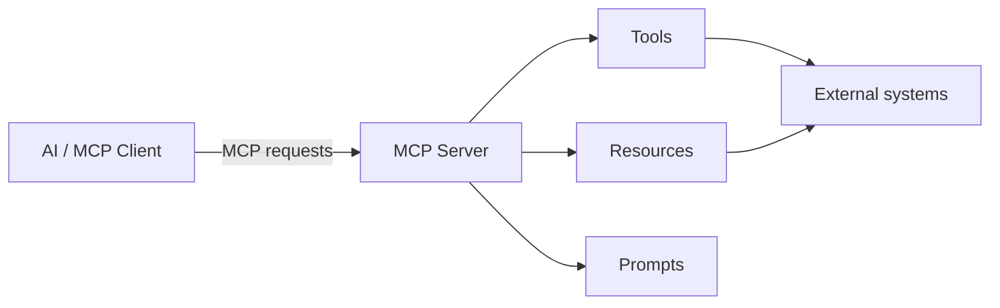
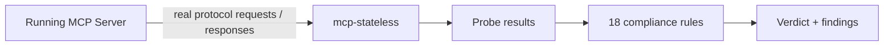
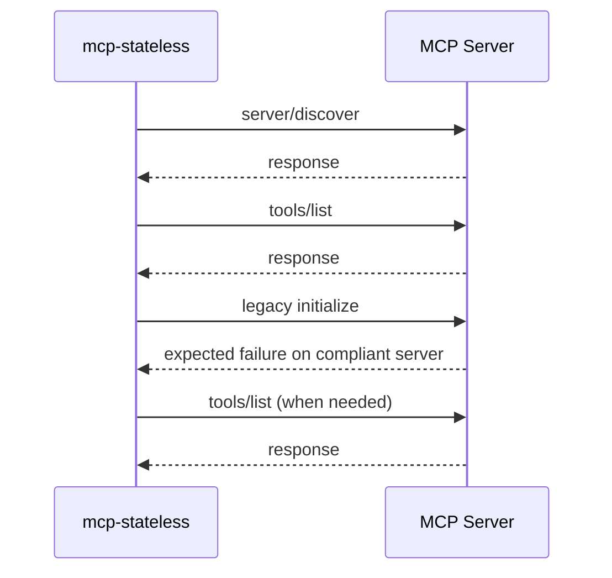
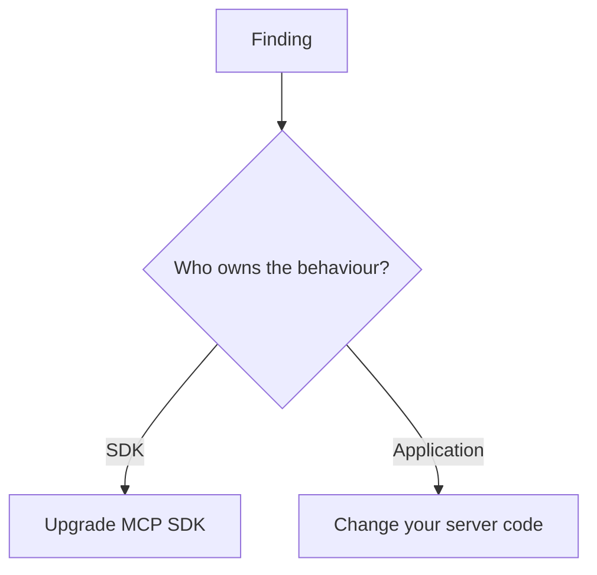
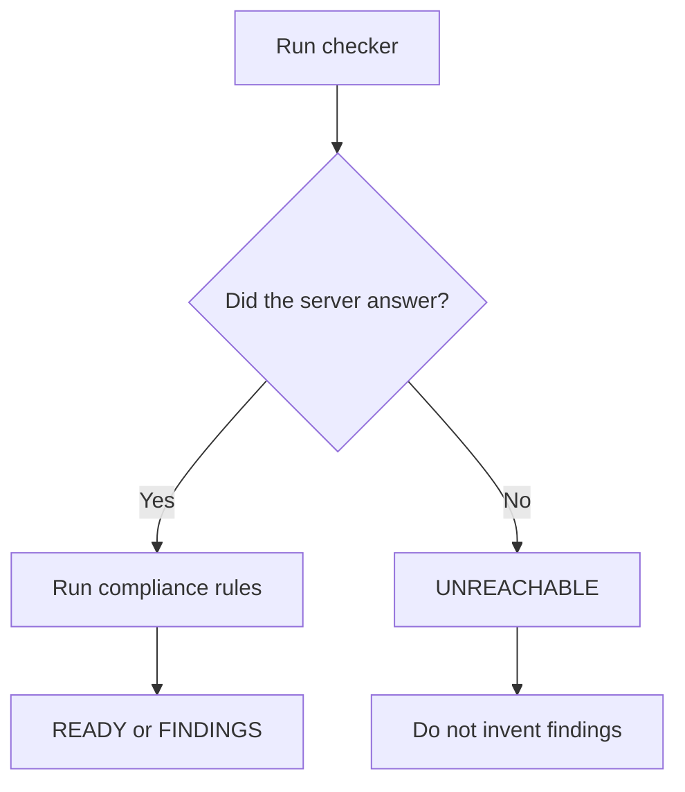
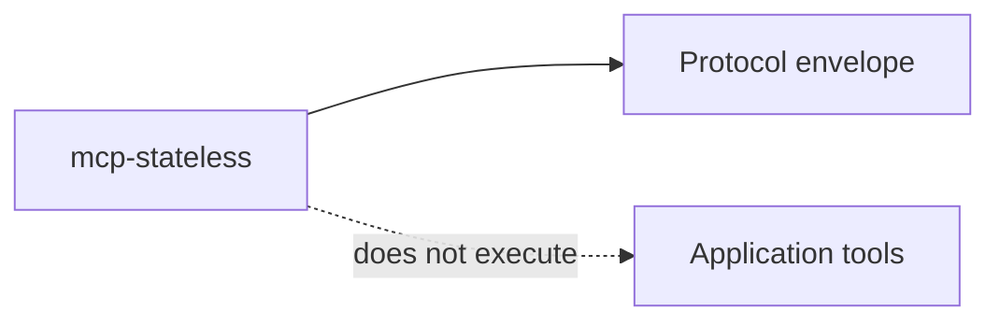
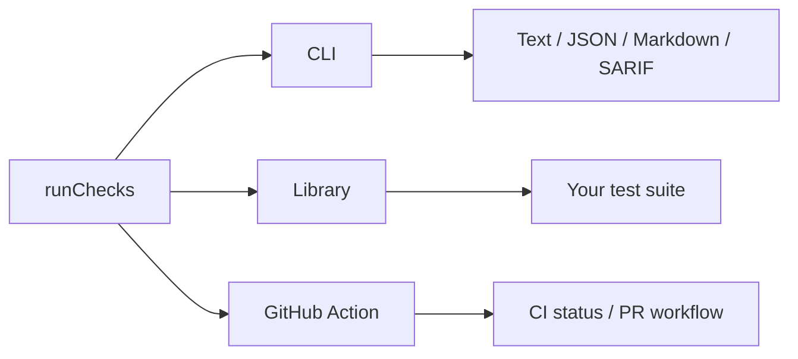
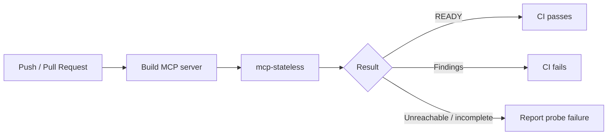
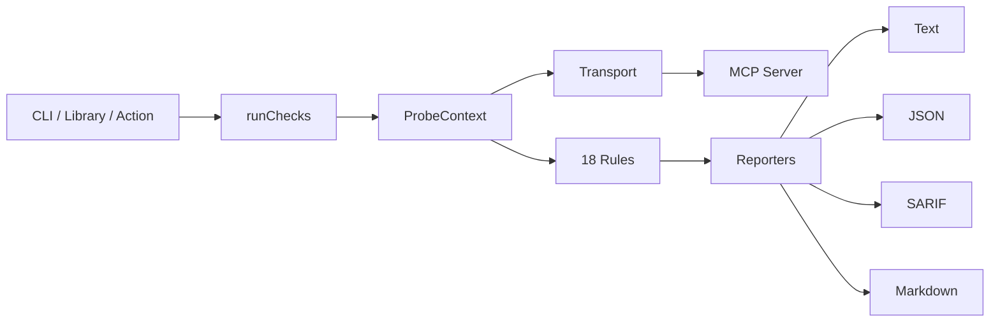
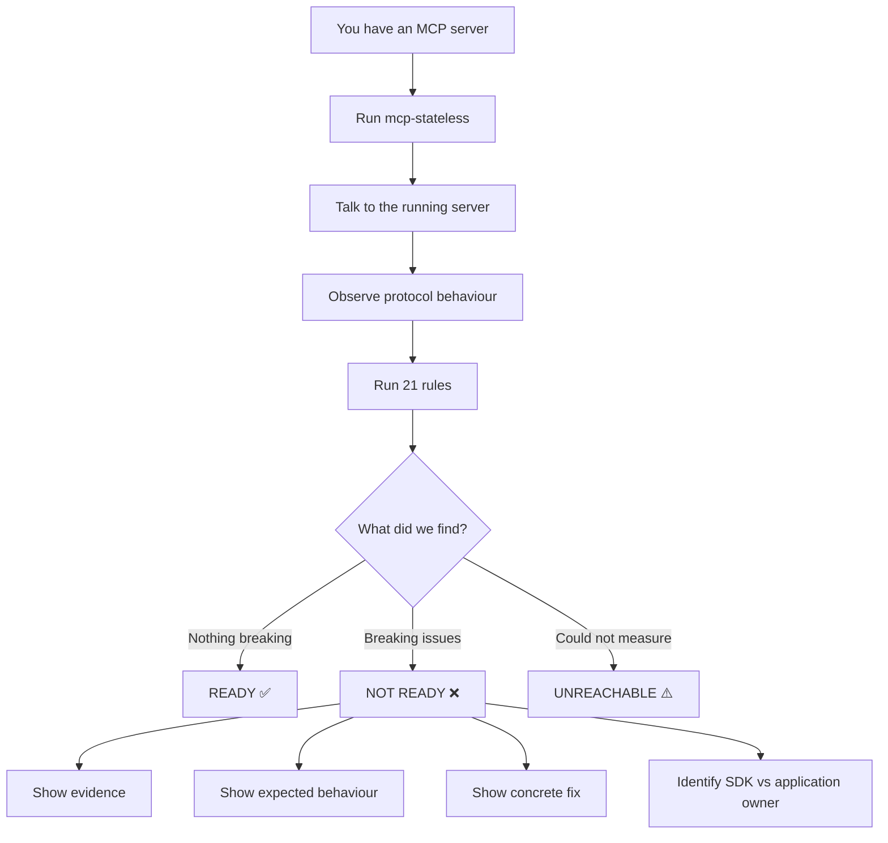

# mcp-stateless — Project Explanation

> **mcp-stateless checks whether a running MCP server is actually ready for the MCP `2026-07-28` stateless specification.**

## 1. What is an MCP server?

**MCP (Model Context Protocol)** lets an LLM application communicate with external capabilities. An MCP server sits between the client and capabilities such as tools, resources and prompts.



For this project, the important part is that an MCP server has **observable protocol behaviour on the wire**.

## 2. What problem does mcp-stateless solve?

The MCP `2026-07-28` revision introduced a major architectural change: the protocol became stateless. Several old behaviours changed or were removed, including the old `initialize` handshake, protocol sessions, `ping`, parts of the HTTP transport, response metadata and error-code behaviour.

An SDK migration or a successful build does **not automatically prove that the running server behaves correctly**.

That is the gap this project targets:

> **Does the server I am actually running conform?**

## 3. The core idea



The checker:

1. Connects to the server.
2. Sends controlled MCP protocol requests.
3. Observes responses, headers and errors.
4. Evaluates the evidence against the rule set.
5. Reports findings and concrete remediation.

It is a **runtime protocol compliance checker**, not a source-code linter.

## 4. How does it check?

The probe uses a fixed opening sequence whose ordering matters.



This lets the checker distinguish different failures that can otherwise look similar from the outside, such as old handshake gating versus other protocol incompatibilities.

## 5. What does it check?

The current project has **21 rules**: 15 breaking rules and 6 deprecations/advisories.

Examples:

| Rule   | Check                                      | Typical owner |
| ------ | ------------------------------------------ | ------------- |
| MCP001 | `server/discover` is not implemented       | SDK           |
| MCP002 | Server still requires `initialize`         | SDK           |
| MCP003 | Old `Mcp-Session-Id` behaviour remains     | SDK           |
| MCP004 | Results are missing `resultType`           | SDK           |
| MCP006 | Removed `ping` is still implemented        | SDK           |
| MCP011 | Old resource-not-found error code          | SDK           |
| MCP013 | Server rejects the `_meta` envelope        | Your code     |
| MCP015 | Deprecated capability declarations         | Your code     |
| MCP017 | `tools/list` ordering is not deterministic | Your code     |

## 6. Why the SDK vs application split matters

Every rule declares who owns the remediation.



This avoids a common problem: an old SDK can create protocol behaviour that the application author never explicitly wrote.

So a result such as:

```text
7 breaking issues

6 → SDK-owned
    Upgrade the MCP SDK

1 → application-owned
    Change your server code
```

is more useful than simply saying “7 things are broken.”

## 7. What happens when the server is correct?

A good compliance checker must be able to say **yes**.

```text
mcp-stateless — checking against MCP 2026-07-28

target: node dist/server.js (stdio)

READY — no breaking issues
Finished in 75ms.
```

This makes the checker suitable for local development and CI.

## 8. What happens when the server cannot be measured?

The project deliberately avoids guessing.

```text
UNREACHABLE — Server process exited before responding.

No checks were run.
Nothing here is a verdict on conformance.
```



A server that failed to start is not evidence of protocol non-compliance.

## 9. It never calls your MCP tools

The checker tests the **protocol layer**, not your business logic.

For example, if a server exposes:

```text
 deleteFile()
 sendEmail()
 createPayment()
 deployProduction()
```

`mcp-stateless` does not call those tools as part of its compliance probe.



## 10. How can it be used?

### stdio

```bash
npx mcp-stateless --stdio "node dist/server.js"
```

### Streamable HTTP

```bash
npx mcp-stateless --http https://api.example.com/mcp
```

Authentication headers are supported as well.

## 11. CLI, library and GitHub Action



The same checking engine can therefore be used during development, inside tests, or in CI.

## 12. CI workflow



Example:

```yaml
- uses: Khanthtutzin/mcp-stateless@v0.3.1
  with:
    stdio: node dist/server.js
    fail-on: error
```

SARIF output can also be uploaded to GitHub for security-style reporting.

## 13. What it deliberately does not check

Some areas require an authentication flow or interactive scenario, so the project does not pretend they are covered by a simple black-box probe.

Currently tracked separately:

- Multi Round-Trip Request conformance — SEP-2322
- Tasks extension migration — SEP-2663
- RFC 9207 `iss` validation — SEP-2468
- Client ID Metadata Documents

The project philosophy is simple:

> **A check you cannot trust is worse than a gap you can clearly see.**

## 14. Architecture at a high level



The transport layer collects protocol evidence. The rules interpret that shared evidence. Reporters turn the findings into formats useful to humans and CI.

## 15. The whole project in one diagram



## 16. Best one-sentence description

> **mcp-stateless is an open-source runtime compliance checker for MCP `2026-07-28` that tests the server you actually run, instead of trusting the SDK version or source code.**
